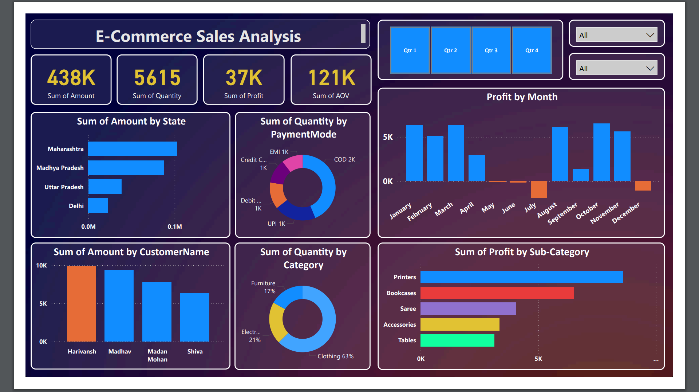

# 📊 Ecommerce Store Data Analysis - Power BI Project
## 📝 Project Overview:  
This project focuses on analyzing data from an Ecommerce store using Power BI.  
The goal is to extract valuable insights into sales performance, customer behavior, and product trends, enabling data-driven decision-making for the business.

## 📂 Project Structure:  
The project is structured as follows:

### 1) Data Source:  
The raw data is collected from the Ecommerce store database, which includes transaction details, customer information, product listings, and other relevant data.  
### 2) Data Preparation:  
Data was cleaned, transformed, and loaded into Power BI. The preparation included handling missing values, removing duplicates, and creating calculated columns and measures for analysis.  
### 3) Power BI Dashboard:  
A comprehensive Power BI dashboard was developed to visualize key metrics and trends. The dashboard includes interactive reports for sales analysis, customer segmentation, product performance, and more.  

## 📂 Project Contents:
**1) data/:** Contains raw and processed data files.  
**2) dashboards/:** Power BI files for interactive dashboards.  
**3) images/:** Screenshots and images of the analysis and dashboards.  
**4) README.md:** Project documentation. 

## 🌟 Key Features:
### 📈 Sales Performance Analysis:
- Total Sales
- Sales Trends Over Time
- Top-selling Products
- Sales by Region and Category
- Customer Behavior Analysis:

### 🧑‍🤝‍🧑 Customer Segmentation:
- Purchase Frequency
- Average Order Value
- Customer Lifetime Value (CLTV)
- Product Analysis:

### 🔥 Product Popularity:
- Stock Levels
- Profit Margins
- Return Rates
  
### 🎛️ Interactive Visualizations:
- Drill-down functionality for in-depth analysis
- Filters and slicers for customized views
- Trend lines and forecasting

## 🛠️ Tools & Technologies
#### Power BI:  
Used for data visualization and report generation.  
#### Python:  
Used for data cleaning and transformation.  
#### SQL:  
Used for querying the Ecommerce database.   
#### Excel:  
Used for initial data exploration and validation.  

## 🚀 Getting Started:
### Prerequisites
1) Python 3.x
2) Power BI Desktop
3) Required Python packages: pandas, numpy, matplotlib, seaborn

## 🚀 Installation & Setup:
### 1) 🔗 Clone the Repository:
git clone https://github.com/yourusername/Ecommerce_Store_Data.git  

### 2) 📂 Open the Power BI File:
Download and open the .pbix file in Power BI Desktop.  

### 3) 🔄 Data Refresh:  
Refresh the data to load the latest information from the database.  

## 🎯 How to Use the Dashboard
### 📈 Sales Overview:
Explore the overall sales performance and identify trends.  

### 👥 Customer Insights:
Analyze customer segments and behaviors.  

### 📦 Product Performance:
Review which products are performing well and which need attention.  

### 🎛️ Interactive Filtering:
Use the filters to view specific time periods, regions, or product categories.

### 🔮 Future Enhancements:
#### Integration with Machine Learning Models: 
To predict customer churn and recommend products.  
#### Automated Data Refresh:  
Setting up scheduled data refresh to ensure real-time analysis.
#### Additional KPIs:  
Adding more key performance indicators based on stakeholder feedback.

## 🖼️ Visualizations:
**Power BI Dashboards Images:**  

  
 

## 👥 Contributors:
#### Akshay Vijayrao Dharmik
(Data Analyst & Developer)

## 📧 Contact
For any inquiries, feel free to reach out at email@example.com.
